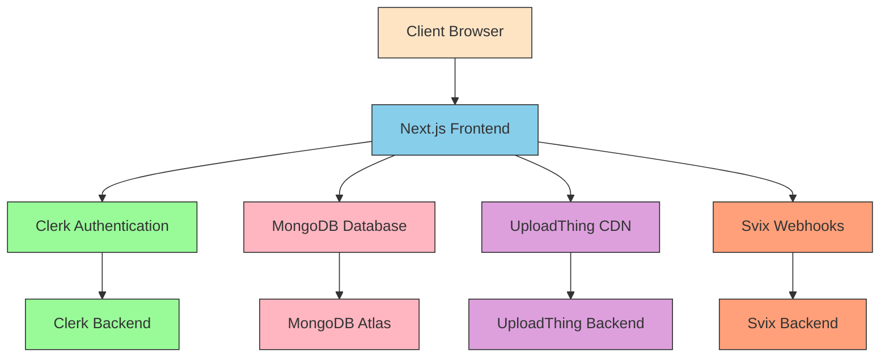
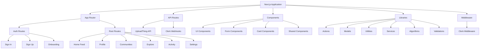

# Chirp Social Media Application - System Architecture

## Overview
Chirp is a full-stack social media application built with modern web technologies. It allows users to create and share short-form content ("chirps"), join communities, follow other users, and engage through likes, comments, and shares.

## High-Level Architecture

## Component Architecture

## Data Flow Architecture

```mermaid
graph LR
    A[User Request] --> B[Next.js Server]
    B --> C[Middleware Authentication]
    C --> D[Route Handler]
    D --> E[Server Action]
    E --> F[Database Query]
    F --> G[MongoDB]
    G --> H[Data Processing]
    H --> I[Response Formatting]
    I --> J[Client Rendering]
    J --> K[UI Components]
    
    E --> L[External API]
    L --> M[Clerk/UploadThing]
    
    style A fill:#FFE4C4
    style B fill:#87CEEB
    style C fill:#98FB98
    style D fill:#87CEEB
    style E fill:#FFB6C1
    style F fill:#FFB6C1
    style G fill:#FFB6C1
    style H fill:#FFB6C1
    style I fill:#FFB6C1
    style J fill:#87CEEB
    style K fill:#DDA0DD
    style L fill:#FFA07A
    style M fill:#FFA07A
```

## Core Domain Models

### User Model
- id (Clerk ID)
- username
- name
- image
- bio
- email
- website
- location
- dateOfBirth
- followers
- following
- chirps
- communities
- isPrivate
- onboarded

### Chirp Model
- text
- author (User)
- community (Community)
- parentId
- children (replies)
- hashtags
- mentions
- likes
- shares
- attachments
- createdAt

### Community Model
- id
- name
- username
- description
- image
- coverImage
- creator (User)
- admins
- members
- isPrivate
- chirps

## Key Features Flow

### Authentication Flow
1. User visits app
2. Clerk Middleware checks authentication status
3. Unauthenticated users redirected to sign-in/sign-up
4. After authentication, user completes onboarding if new
5. Authenticated users proceed to main app

### Chirp Creation Flow
1. User submits chirp through form
2. Client-side validation with Zod
3. Server action processes request
4. Mentions and hashtags extracted
5. Media uploaded via UploadThing
6. Chirp saved to MongoDB
7. Notifications triggered for mentions
8. User redirected/feed updated

### Feed Algorithm Flow
1. User visits home page
2. Smart feed algorithm runs
3. Personalized content selected
4. Infinite scroll implemented
5. Real-time updates with Intersection Observer
6. Engagement metrics tracked

### Notification System
1. Actions trigger notification events
2. Svix handles webhook delivery
3. Notification service processes events
4. Users receive real-time updates
5. Notification preferences respected

## Technology Stack

### Frontend
- Next.js 15 with App Router
- React 19
- TypeScript
- Tailwind CSS
- Radix UI Components
- React Hook Form + Zod

### Backend
- Next.js API Routes
- Server Actions
- MongoDB with Mongoose
- Clerk for Authentication
- UploadThing for File Storage
- Svix for Webhooks

### Infrastructure
- Vercel Deployment
- MongoDB Atlas
- UploadThing CDN
- Clerk Authentication Service
- Svix Webhook Service

## Security Considerations
- Clerk handles authentication and session management
- Input validation with Zod
- Protected routes with middleware
- Private communities with access control
- User privacy settings
- Content moderation capabilities

## Performance Optimizations
- Server-side rendering
- Static site generation where appropriate
- Image optimization with Next.js
- Code splitting
- Infinite scroll for feeds
- Caching with React cache
- Database indexing