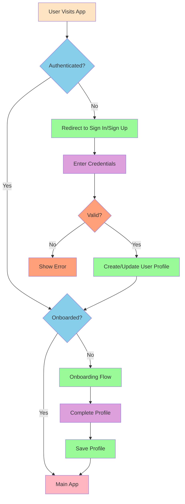
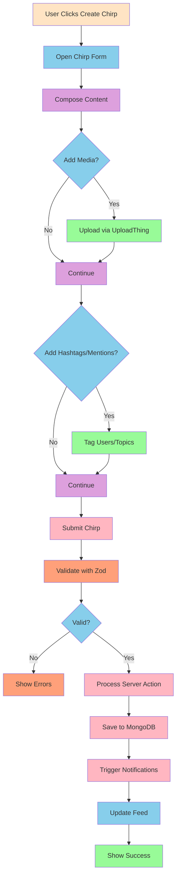
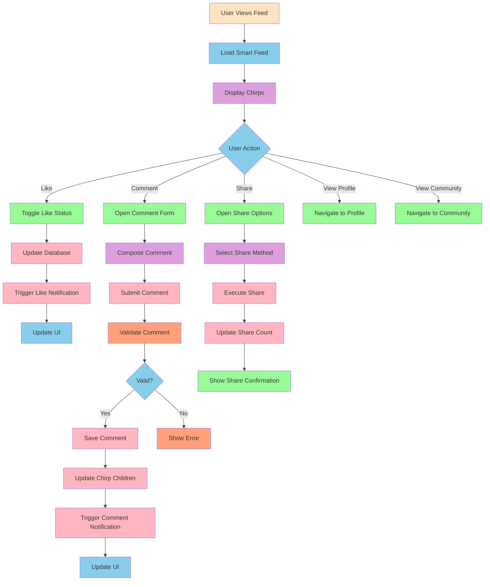
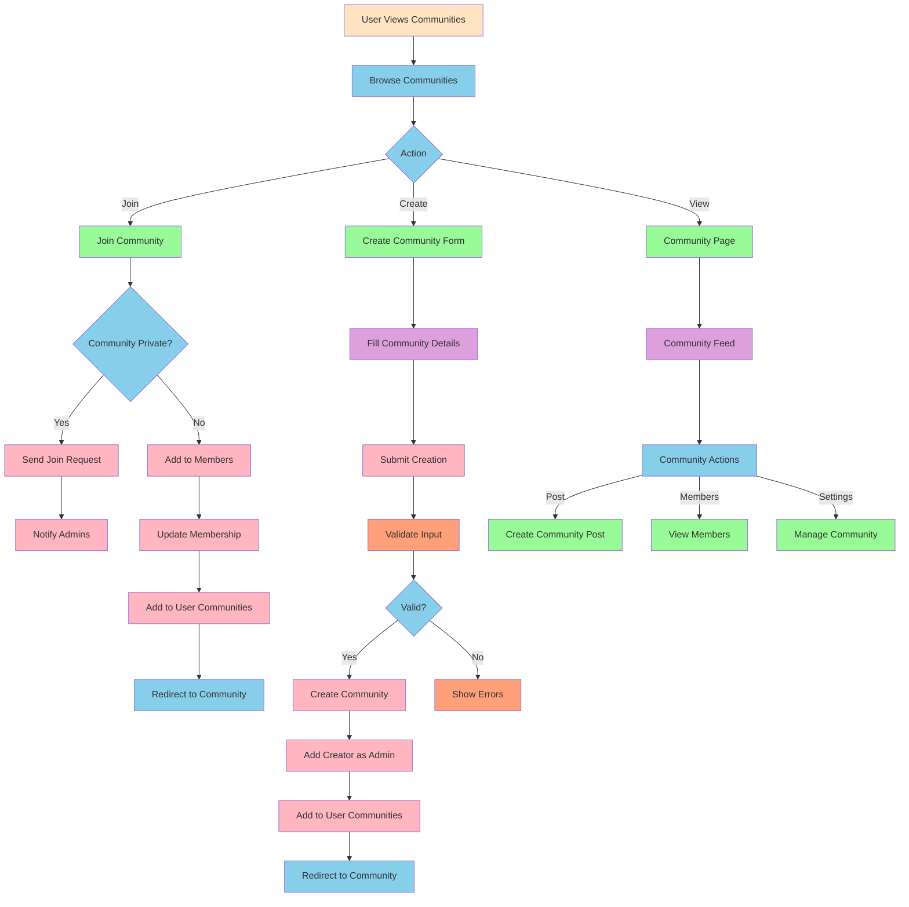
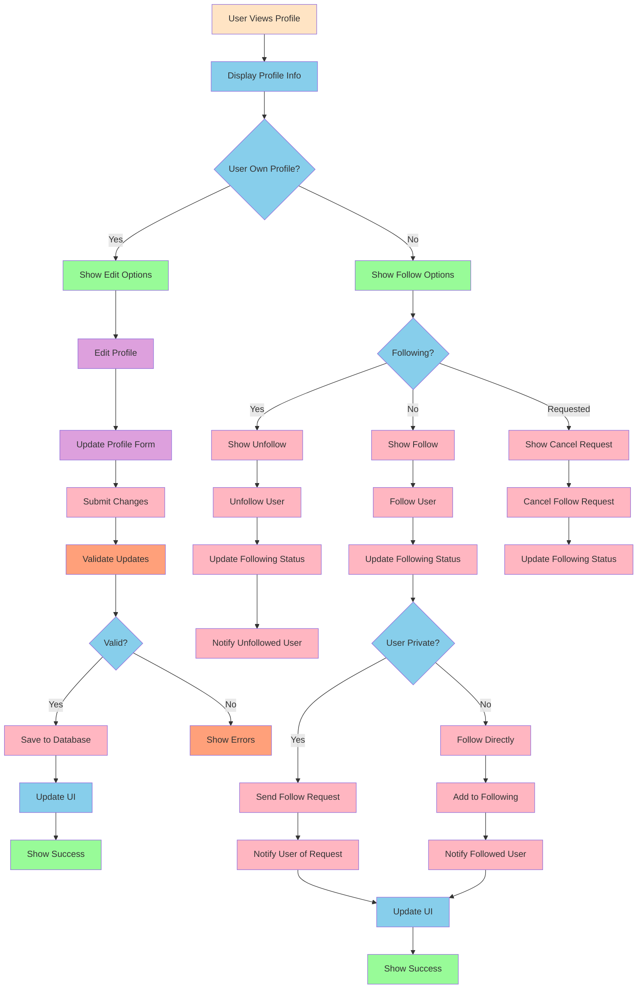

# Chirp Application - User Flow Diagrams

## Authentication Flow

```mermaid
graph TD
    A[User Visits App] --> B{Authenticated?}
    B -->|No| C[Redirect to Sign In/Sign Up]
    B -->|Yes| D{Onboarded?}
    D -->|No| E[Onboarding Flow]
    D -->|Yes| F[Main App]
    C --> G[Enter Credentials]
    G --> H{Valid?}
    H -->|Yes| I[Create/Update User Profile]
    H -->|No| J[Show Error]
    I --> D
    E --> K[Complete Profile]
    K --> L[Save Profile]
    L --> F

    style A fill:#FFE4C4
    style B fill:#87CEEB
    style C fill:#98FB98
    style D fill:#87CEEB
    style E fill:#98FB98
    style F fill:#FFB6C1
    style G fill:#DDA0DD
    style H fill:#FFA07A
    style I fill:#98FB98
    style J fill:#FFA07A
    style K fill:#DDA0DD
    style L fill:#98FB98
```

## Chirp Creation Flow

```mermaid
graph TD
    A[User Clicks Create Chirp] --> B[Open Chirp Form]
    B --> C[Compose Content]
    C --> D{Add Media?}
    D -->|Yes| E[Upload via UploadThing]
    D -->|No| F[Continue]
    E --> F
    F --> G{Add Hashtags/Mentions?}
    G -->|Yes| H[Tag Users/Topics]
    G -->|No| I[Continue]
    H --> I
    I --> J[Submit Chirp]
    J --> K[Validate with Zod]
    K --> L{Valid?}
    L -->|No| M[Show Errors]
    L -->|Yes| N[Process Server Action]
    N --> O[Save to MongoDB]
    O --> P[Trigger Notifications]
    P --> Q[Update Feed]
    Q --> R[Show Success]

    style A fill:#FFE4C4
    style B fill:#87CEEB
    style C fill:#DDA0DD
    style D fill:#87CEEB
    style E fill:#98FB98
    style F fill:#DDA0DD
    style G fill:#87CEEB
    style H fill:#98FB98
    style I fill:#DDA0DD
    style J fill:#FFB6C1
    style K fill:#FFA07A
    style L fill:#87CEEB
    style M fill:#FFA07A
    style N fill:#FFB6C1
    style O fill:#FFB6C1
    style P fill:#FFB6C1
    style Q fill:#87CEEB
    style R fill:#98FB98
```

## Feed Interaction Flow

```mermaid
graph TD
    A[User Views Feed] --> B[Load Smart Feed]
    B --> C[Display Chirps]
    C --> D{User Action}
    D -->|Like| E[Toggle Like Status]
    D -->|Comment| F[Open Comment Form]
    D -->|Share| G[Open Share Options]
    D -->|View Profile| H[Navigate to Profile]
    D -->|View Community| I[Navigate to Community]
    E --> J[Update Database]
    J --> K[Trigger Like Notification]
    K --> L[Update UI]
    F --> M[Compose Comment]
    M --> N[Submit Comment]
    N --> O[Validate Comment]
    O --> P{Valid?}
    P -->|Yes| Q[Save Comment]
    P -->|No| R[Show Error]
    Q --> S[Update Chirp Children]
    S --> T[Trigger Comment Notification]
    T --> U[Update UI]
    G --> V[Select Share Method]
    V --> W[Execute Share]
    W --> X[Update Share Count]
    X --> Y[Show Share Confirmation]

    style A fill:#FFE4C4
    style B fill:#87CEEB
    style C fill:#DDA0DD
    style D fill:#87CEEB
    style E fill:#98FB98
    style F fill:#98FB98
    style G fill:#98FB98
    style H fill:#98FB98
    style I fill:#98FB98
    style J fill:#FFB6C1
    style K fill:#FFB6C1
    style L fill:#87CEEB
    style M fill:#DDA0DD
    style N fill:#FFB6C1
    style O fill:#FFA07A
    style P fill:#87CEEB
    style Q fill:#FFB6C1
    style R fill:#FFA07A
    style S fill:#FFB6C1
    style T fill:#FFB6C1
    style U fill:#87CEEB
    style V fill:#DDA0DD
    style W fill:#FFB6C1
    style X fill:#FFB6C1
    style Y fill:#98FB98
```

## Community Interaction Flow

```mermaid
graph TD
    A[User Views Communities] --> B[Browse Communities]
    B --> C{Action}
    C -->|Join| D[Join Community]
    C -->|Create| E[Create Community Form]
    C -->|View| F[Community Page]
    D --> G{Community Private?}
    G -->|Yes| H[Send Join Request]
    G -->|No| I[Add to Members]
    H --> J[Notify Admins]
    I --> K[Update Membership]
    K --> L[Add to User Communities]
    L --> M[Redirect to Community]
    E --> N[Fill Community Details]
    N --> O[Submit Creation]
    O --> P[Validate Input]
    P --> Q{Valid?}
    Q -->|Yes| R[Create Community]
    Q -->|No| S[Show Errors]
    R --> T[Add Creator as Admin]
    T --> U[Add to User Communities]
    U --> V[Redirect to Community]
    F --> W[Community Feed]
    W --> X[Community Actions]
    X -->|Post| Y[Create Community Post]
    X -->|Members| Z[View Members]
    X -->|Settings| AA[Manage Community]

    style A fill:#FFE4C4
    style B fill:#87CEEB
    style C fill:#87CEEB
    style D fill:#98FB98
    style E fill:#98FB98
    style F fill:#98FB98
    style G fill:#87CEEB
    style H fill:#FFB6C1
    style I fill:#FFB6C1
    style J fill:#FFB6C1
    style K fill:#FFB6C1
    style L fill:#FFB6C1
    style M fill:#87CEEB
    style N fill:#DDA0DD
    style O fill:#FFB6C1
    style P fill:#FFA07A
    style Q fill:#87CEEB
    style R fill:#FFB6C1
    style S fill:#FFA07A
    style T fill:#FFB6C1
    style U fill:#FFB6C1
    style V fill:#87CEEB
    style W fill:#DDA0DD
    style X fill:#87CEEB
    style Y fill:#98FB98
    style Z fill:#98FB98
    style AA fill:#98FB98
```

## Profile Management Flow

```mermaid
graph TD
    A[User Views Profile] --> B[Display Profile Info]
    B --> C{User Own Profile?}
    C -->|Yes| D[Show Edit Options]
    C -->|No| E[Show Follow Options]
    D --> F[Edit Profile]
    F --> G[Update Profile Form]
    G --> H[Submit Changes]
    H --> I[Validate Updates]
    I --> J{Valid?}
    J -->|Yes| K[Save to Database]
    J -->|No| L[Show Errors]
    K --> M[Update UI]
    M --> N[Show Success]
    E --> O{Following?}
    O -->|Yes| P[Show Unfollow]
    O -->|No| Q[Show Follow]
    O -->|Requested| R[Show Cancel Request]
    P --> S[Unfollow User]
    Q --> T[Follow User]
    R --> U[Cancel Follow Request]
    S --> V[Update Following Status]
    T --> W[Update Following Status]
    U --> X[Update Following Status]
    V --> Y[Notify Unfollowed User]
    W --> Z{User Private?}
    Z -->|Yes| AA[Send Follow Request]
    Z -->|No| AB[Follow Directly]
    AA --> AC[Notify User of Request]
    AB --> AD[Add to Following]
    AD --> AE[Notify Followed User]
    AC --> AF[Update UI]
    AE --> AF
    AF --> AG[Show Success]

    style A fill:#FFE4C4
    style B fill:#87CEEB
    style C fill:#87CEEB
    style D fill:#98FB98
    style E fill:#98FB98
    style F fill:#DDA0DD
    style G fill:#DDA0DD
    style H fill:#FFB6C1
    style I fill:#FFA07A
    style J fill:#87CEEB
    style K fill:#FFB6C1
    style L fill:#FFA07A
    style M fill:#87CEEB
    style N fill:#98FB98
    style O fill:#87CEEB
    style P fill:#FFB6C1
    style Q fill:#FFB6C1
    style R fill:#FFB6C1
    style S fill:#FFB6C1
    style T fill:#FFB6C1
    style U fill:#FFB6C1
    style V fill:#FFB6C1
    style W fill:#FFB6C1
    style X fill:#FFB6C1
    style Y fill:#FFB6C1
    style Z fill:#87CEEB
    style AA fill:#FFB6C1
    style AB fill:#FFB6C1
    style AC fill:#FFB6C1
    style AD fill:#FFB6C1
    style AE fill:#FFB6C1
    style AF fill:#87CEEB
    style AG fill:#98FB98
```